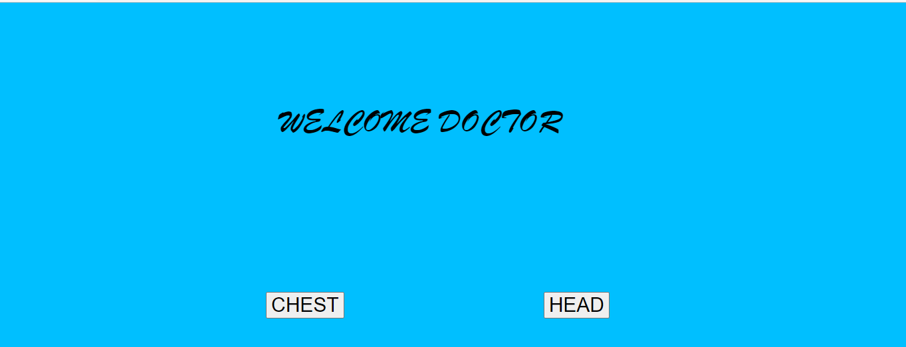
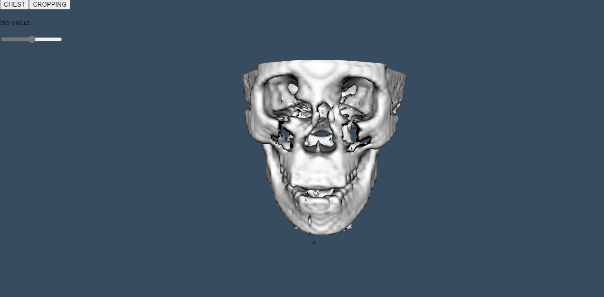
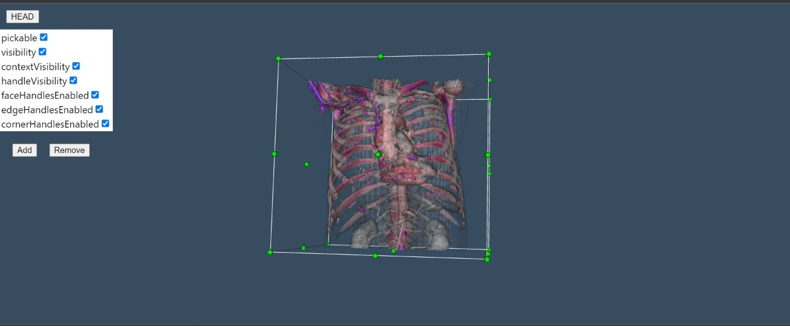
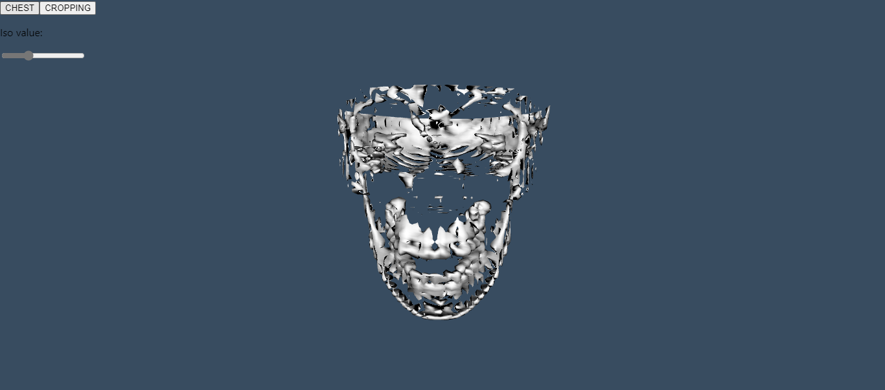

# Final Project: Volume Rendering (VTK)
###### simple volume rendring website with Node.js and React
   +
   
Name | Sec | BN |   
--- | --- | --- | 
salma Hussien  | 1 | 38
Sandra essa | 1 | 35 
Habiba mohamed | 1 | 25


# Main Idea 
we display CT for Chest and Head applying widget on both of them but ray casting only on Chest and Marching cubes on Head.

# Implmentation Details
 ## Table of contents
* [rendring window setup ](#rendring window setup)
* [Switching between head and chest](#Switching between head and chest)
* [marching cubes on head ](#marching cubes iin head )
* [ray casting on chest  ](#ray casting on chest  )
* [widget cropping on Head and Chest ](#widget cropping on Head and Chest)

## rendring window setup 
first we creat instance of vtkFullScreenRenderWindow class setting background to whatever color you want 

```

    const fullScreenRenderer = vtkFullScreenRenderWindow.newInstance({
        background: [0, 0, 0],
    });
```
then we get its render and render window objects 
```

  const renderer = fullScreenRenderer.getRenderer();
    const renderWindow = fullScreenRenderer.getRenderWindow();
    const apiRenderWindow = fullScreenRenderer.getApiSpecificRenderWindow();
```
## Switching between head and chest
there are two buttons to choose go to head or chest 
when we display head there are button to go to chest and the same for chest 




## marching cubes on head
it apply iso value on head go into/out head and show its details 




## ray casting on chest
we change color of chest and its details

```

  const renderer = fullScreenRenderer.getRenderer();
    const renderWindow = fullScreenRenderer.getRenderWindow();
    const apiRenderWindow = fullScreenRenderer.getApiSpecificRenderWindow();
```


